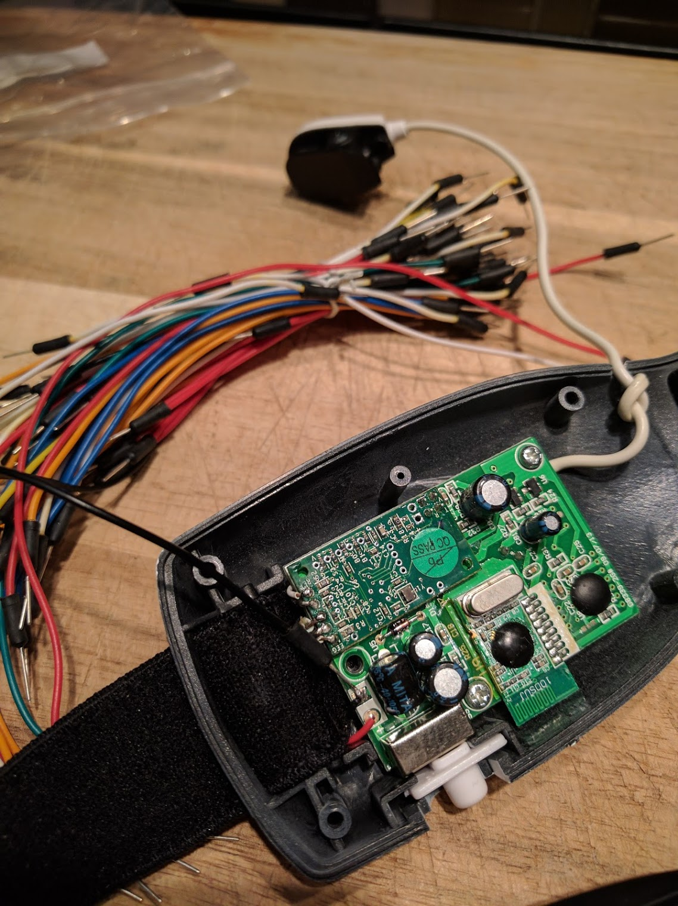
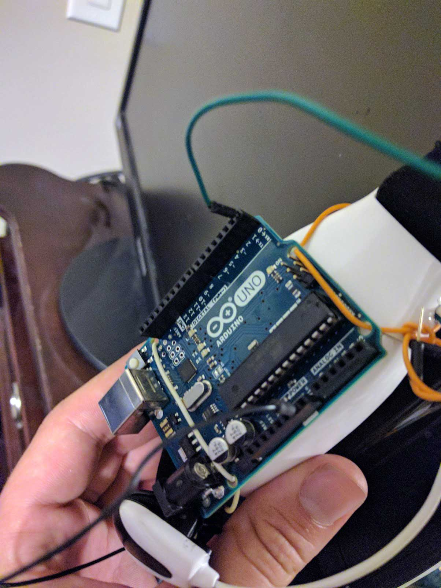
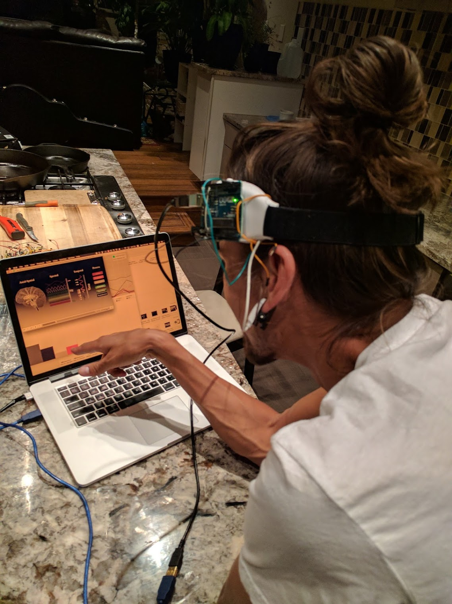

# Arduino-EEG-Graphing
Graphing in Processing

Quickly uploading some things I've been playing a lot with recently.

In order to learn my Arduino and play with brainwaves, this is a physically hacked Mindflex EEG setup with an arduino.

The EEG data comes in through serial and 
is set through Processing for some great neurofeedback expiriments.

I have been learning, customizing and playing around with fantastic work created and shared by Eric Mika  
eric@ericmika.com  
https://github.com/kitschpatrol
http://frontiernerds.com

Thanks!
